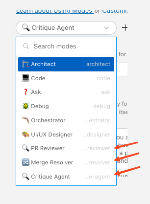
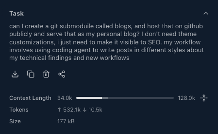
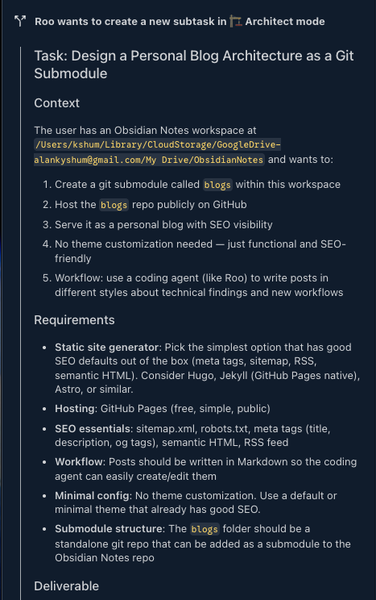
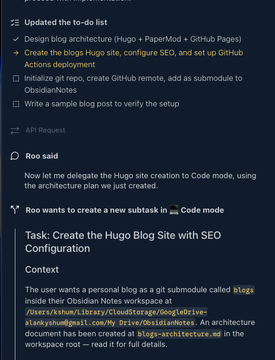
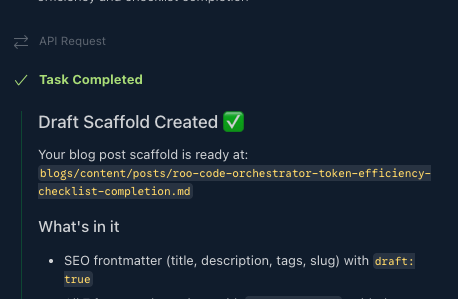

## 1) The Hook
Three problems kept repeating in long coding runs: the agent paused mid-task to ask clarifying questions, checklist items got marked done without real verification, and context bloat made later steps drift.

I needed execution that stayed mostly hands-off once started, with verification gates that actually held. Roo Code orchestrator solved this by splitting one large objective into scoped subtasks with explicit completion criteria and tighter context boundaries.

## 2) Context & Constraints
My baseline was the standard "one big prompt" workflow in a single coding session. That pattern is fine for short edits. It degrades when work spans planning, implementation, validation, and review.

### My Requirements
- **Minimal human intervention during execution:** questions should be asked upfront, not in the middle of the run.
- **Checklist reliability:** items are not complete until they are both implemented and verified.
- **Tight handoffs between steps:** each subtask should carry only the context required for that step.

I treat the orchestrator as a PM control loop, not a magic single developer: define scope, assign work, verify outputs, then move to the next milestone.

### Environment Limitations
- **Provider behavior in my setup:** I run Roo Code through VS Code's LLM API provider path.
- **Effective context cap at product layer:** in practice this surfaces as an effective window commonly around ~64K-128K, even when a model's native limit may be higher.
- **Practical implication:** context carry-over must be managed aggressively on long, multi-phase tasks.



Rejected alternatives:
1. **One giant prompt in a single Code session** — rejected because prior outputs accumulate and increase drift/retry cost.
2. **Manual copy/paste across separate chats** — rejected because coordination overhead is high and state tracking is fragile.

I also tested Claude Code agent teams but found them harder to control for this workflow shape.

## 3) The Approach
I used role-specialized routing as an explicit engineering decision:
- **Opus** for orchestration and decomposition (as of early 2026)
- **Sonnet** for implementation-heavy file operations (as of early 2026)
- **GPT/Codex** reserved in routing policy for debugging-heavy branches when needed

The key principle: model roles are **moving labels, not constants**. I route by task signals (complexity, ambiguity, failure mode), not by static model branding.

Instead of forcing one agent to hold everything, I decomposed work into 8 subtasks with explicit acceptance criteria. Each subtask received minimal context and returned a compact handoff to the orchestrator.

Trade-off: orchestration adds setup and validation overhead. Payoff: less context bloat, cleaner retries, and higher completion reliability across multi-concern workflows.

## 4) The Implementation
I used a real workflow: setting up my personal blog.

**Step 1 — Seed orchestrator with the objective and constraints**
The orchestrator session used ~34K out of 128K (including system prompts + history) because most execution context lived in delegated subtasks.


**Step 2 — Delegate discovery to Architect mode**
Architect mode mapped folder structure and constraints before implementation.


**Step 3 — Run sequentially with checklist gating**
Progress only advanced when each subtask met its acceptance condition.


**Step 4 — Close on a fully completed checklist**
The run ended with an auditable checklist across all delegated steps.


**Task Timeline — reported by Roo Code**

| # | Subtask | Agent Mode | Duration |
|---|---------|-----------|----------|
| 1 | Design blog architecture (Hugo + PaperMod + GitHub Pages) | 🏗️ Architect | ~1 min |
| 2 | Create Hugo site, configure SEO, GitHub Actions deployment | 💻 Code | ~4 min |
| 3 | Init git repo, create GitHub remote, add as submodule | 💻 Code | ~3 min |
| 4 | Write sample blog post, build, push, trigger deploy | 💻 Code | ~2 min |
| 5 | Analyze ObsidianNotes workspace for themes & patterns | ❓ Ask | ~1 min |
| 6 | Create `write-blog-post` Roo skill | 💻 Code | ~2 min |
| 7 | Refine skill with 7-section framework + 3-phase workflow | 💻 Code | ~2 min |
| 8 | Bootstrap draft scaffold for orchestrator blog post | 💻 Code | ~2 min |
| — | **Total** | **🪃 Orchestrator** (coordinator) | **~14 min** |

6 of 8 subtasks ran in 💻 Code mode. The orchestrator mostly handled routing, scoping, and acceptance control.

Minimal scoped subtask instruction example:

```text
Task: Create Hugo site skeleton and PaperMod config only.
Scope: Touch files under blogs/ only. Do not run git push. Do not create blog content.
Output contract:
1) List files created/changed.
2) Show final config keys changed.
3) Confirm `hugo --minify` passes.
```

## 5) Results & Numbers
These are run-level observations from one workflow, not controlled benchmarks.

Quantified scoped-context impact:
- Orchestrator session consumed **~34K/128K** (full coordinator context, including system prompts + history).
- Delegated subtask instruction payloads summed to **~14K** (estimated).
- Equivalent single-session carry-over for this workflow was estimated around **~40-60K+**.

| Dimension | 🪃 Orchestrator (observed) | 💻 Code Only (estimated for same workflow) |
|---|---|---|
| **Context growth pattern** | Fresh scoped contexts per subtask (~2-4K each) + compact handoffs | One accumulating conversation with prior file reads + command outputs |
| **Token efficiency** | ~14K total delegated payload | ~40-60K for equivalent multi-step flow |
| **Failure blast radius** | Failed step retries in isolation | Failures can force broader re-validation/rework |
| **Task drift risk** | Lower, due to explicit step scope and output contracts | Higher, as objectives and artifacts compete in one context |
| **Estimated elapsed time** | ~14 min | ~20-30 min |

Wins vs misses:
- **Improved:** checklist completion reliability, retry containment, token discipline.
- **Still expensive/slow:** orchestration setup overhead and manual judgment on when to reset context.

## 6) Lessons Learned
### When Code-only is fine
- Tasks with ≤3 steps
- Tasks that don't require broad file exploration
- Tasks where every step shares the same active context (for example, focused module refactors)

### When Orchestrator wins
- Workflows with 5+ distinct steps across different concerns
- Research → design → implement → verify chains
- Cases where only distilled outputs should flow to downstream steps

### Practical takeaways
1. **Scope quality dominates model quality in long runs.** Better decomposition beat "stronger model" assumptions.
2. **Ask early, execute uninterrupted.** Front-loading questions reduced mid-run stalls.
3. **Verification must be explicit.** Checklist completion improved only after adding acceptance gates and concrete output contracts.
4. **Reset aggressively on objective shifts.** Weakly related follow-ups after "done" caused relevance failures more often than fresh runs.
5. **Treat orchestration as control-plane engineering.** The value is not parallelism by default; it's bounded context, measurable handoffs, and controlled retries.

## 7) What’s Next
Open questions I want to test:
- Can subtask sizing be automated from token budget + dependency graph + risk score?
- What memory retrieval policy preserves continuity without re-inflating context?

Known limits so far:
- Cross-subtask state gets fuzzy when outputs are underspecified.
- Follow-up tasks after "done" often fail relevance checks unless I restart with a fresh objective package.
- Parallel agent workflows can increase token burn quickly without strict output contracts.

I am also evaluating Claude Code agent teams as a comparison point, especially for parallel execution visibility and explicit usage boundaries.

I’m interested in concrete restart heuristics from real teams: the measurable signal you use to terminate an orchestration run, reset context, and relaunch cleanly.
